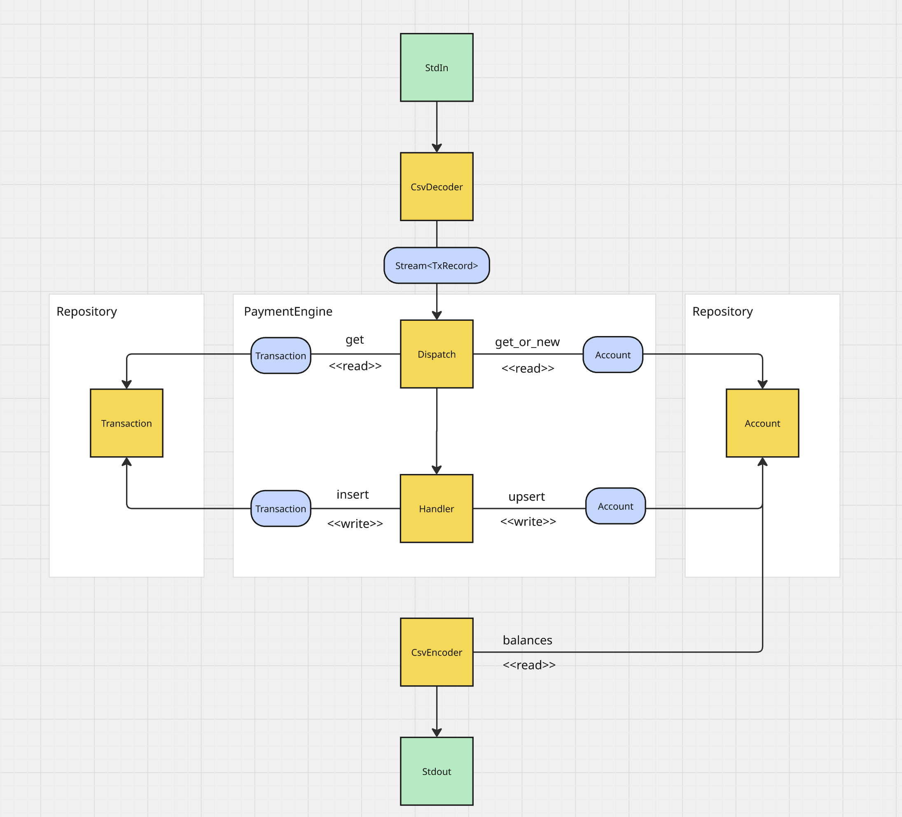

# simple-payment-engine

This repository contains an "experiment", showcasing a simplified implementation of a payment engine in Rust.

## Requirements

In this section, functional and non-functional requirements are briefly listed. As this is an reduced and simplyfied project, any assumptions and limitations are also described in a dedicated section in this document.

### Functional

The project is a simple Rust binary. It can be invoked by `cargo run`, implementing an inferface based on `stdin` and `stdout`.
CSV encoded payment transaction are fed into the system this way. The transaction get parsed and processed. Finally, the client account balance will be outputted to `stdout`, also encoded as CSV

The engine implements the following business use-cases:

- `Deposit`: transfer funds from the clients fiat account to their asset account
- `Withdrawal`: transfer funds from the clients asset account to their fiat account
- `Dispute`: client claim for raising a dispute on a previously processed transaction
- `Resolve`: resolve a raised dispute
- `Chargeback`: finally charge back the funds to the clients fiat account

### Non-functional

- The dimension for the expected load are only roughly specified: in the spec there is a hint which leads to an expected upper bound of [`u32::MAX`](https://doc.rust-lang.org/std/primitive.u32.html#associatedconstant.MAX) transactions to be processed
- Documentation about design decisions, findings, etc.
- Strong focus lies on:
    - **Security** => Using the algebraic type system
    - **Correctness** => Implementing the use cases by unit and integration tests
    - **Safetiness & robustness** => Contextual error handling
    - **Efficiency** => Using efficient data structures and e.g. Copy types
    - **Maintainability** => Having a clear sepeparation of components and responsibilities. The desing allows future extension and changes.

## Key Design Decisions

This section describes which key decisions has been taken including the reasoning behind.
Leverage the advantages of the `Rust` programming language:

- Algebraic Type System (ATS) to make undesired state not representable in the system:  
    Multiple examples can be found in the code. E. g. newtype pattern has been used for defining foundational domain entities like `ClientId` or `NonNegativeDecimal`. This way, I can enforce domain constraints already at the outer boundaries of the system. Second, there is additional control about which API surface one wants to expose to the rest of the application. E.g. the `ClientId` wraps a `u16`. Everyone knows that intergers can be summed up. But how is the addition of two `ClientId`s defined? This is probably not valuable or could become even dangerous when one tries to add unique identifiers which are also used for referential integrity. Another example is the `NonNegativeDecimal` type, that actively prevents incidents or an attack vector.
- Flexibility in using high-level but zero-cost abstractions
- Applying `Secure-By-Design` and `Domain-Driven-Design` principles in the application design and the designed types.
- Strong ecosystem of high quality crates:
    - Asynchronous programming by utilizing the `tokio` runtime, in conjunction with the `futures` crate and abstractions like `Futures`, `Stream` and more.
    - Error handling using the `anyhow` crate. Please also have a look at the [Limitations section](#limitations).
    - `Serde` for serialization
- Applying foundations principles like Open/Close or Separation-of-Concerns, enabling a flexible design, that is open for change.
- Good testability of the system, and sufficient test coverage for the most important parts.
- Used design is composable: e.g. the stream is a higher level abstraction, that fosters composition and flexibility.
- Used the `Decimal` type to represent amounts.
- Limit the amount of used crates and their features for fast build times and small binary sizes

## High level system design

On a high level, payment transaction data can be provided as a CSV file. When invoking the binary, the path to that file is expected to be provided as first and only argument. As the data is provided as CSV, transaction data will be parsed by the `CsvDecoder` into a domain specifc type. The decoder returns a fused stream, that can be used in the `PaymentEngine` for processing the transactions.  
The engine has read and write access to the `Account` repository, and the `Transaction` repository.
Both entities represent a potential persistence layer. In the context of this project, both repositories are used in memory, without any persistence.
The engine consists of two parts. A dispatch, that ensures data integrity and delegates an incoming transaction record, to a handler function, that is able to process it.
Account data and transaction data are stored in the corresponding repositories.

Finally, the engine stops and the binary will invoke the `CsvEncoder` with the `Account`. It will serialize the data into `stdout` in the expected format.

### CsvDecoder

- Simple to use interface :)
- Stream based implementation for efficient consuming parsed transactions.
- Converts internally between `DeTxRecord` to `TxRecord` resulting in semantically better fitting types esp. when representic amounts. This remove optional amounts completely.
- Generic static dispatch implementation allows it to be used with differernt `std::io::Read` implementations.

### Engine

- Minimal and simple interface.
- The engine marks the entry-point in the async part of the system and the processing of the provided stream.
- The stream is a key abstraction, which enables composition, flexibility and testability.
- It serves mainly two purposes: dispatching to the correct handler and ensuring data integrity.
- Handler functions know how to process a transaction of a certain type.
- Data changes to accounts and transactions are communicated to the specialized repositories.

## Disclaimer

I invested significant time to demonstrate my experience. To showcase patterns and concepts, I introduce more abstractions and system design than necessary, while still focusing on quality, delivery and the use cases.

### AI usage

I intentionally did not use any AI for developing this project for mainly two reasons:

1. From my past experience, the Copilot support is not very helpful when it comes to complex async code. In the past it produced more problems, compared to the assistance it provided.
1. It was a very interesting project and problem domain, thus I had a lot of fun realizing it :)

## Assumptions

1. Given the CSV protocol, is it possible that a `Dispute` request references a former `Withdrawal` transaction, that has been processed successfully. I'm not used to the domain, thus I implemented this case.  
After I completed it, I reflected about the implementation and the semantics, which seriously led myself question, if this is a valid use case at all. I assume, that its not and it could be the better strategy to skip such cases. I still retained the code in the project, for being discussed or revisited somewhen in the future.

1. I encoded the assumption that negative amounts for `Deposit`s and `Withdrawal`s are dangerous, and could be seen as fraud. Thus, I decided to skip those transactions in the CSV. There is a dedicated type `NonNegativeDecimal` that I introduced. Thus it is not possible to work with the engine and negative decimals.

1. There was a potential attack vector by replaying already processed `Deposit`s or `Withdraw`s. The system does not allow replaying sucessfully processed transactions for both types.

## Limitations

1. For the implementation of `Dispute`, `Resolve` and `Chargeback`, the requirement came up to persist `Deposit` and `Withdrawal` transactions, as they might be referenced. Only `Deposit` and `Withdrawal` transactions are *stored* in the transaction repository, including their status.
Thus, this kind of storage is not sufficient for having an audit trail, probably is necessary in a production workload.

1. Although I decided to implement a flexible async engine, I don't known the load behavior, and currently only one thread will be used (the one the future runs on). Due to the absence of a proper telemetry system, I decided that this is sufficient for now and this can be revisited in the future, as the system design is flexible for being changed.

1. The `CsvDecoder` only accepts known transaction types. It skips everything else. This is sufficient for the experiment. In a production workload, a dedicated variant might make sense, to capture unsucessfull deserialization attemps.

1. I decided to have *complete* error handling in place, but limited it to `anyhow` due to its ergonomics. In a production system, I'd rather implement proper error types.

1. Proper instrumentation is out-of-scope, because it would have cost too much time and focus. For a production system, this aspect would be a must to understand the system behavior esp. when the load changes.
